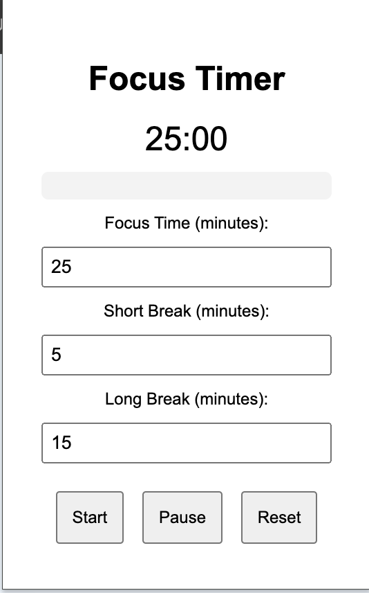

# Focus Timer Chrome Extension

A simple and customizable focus timer Chrome extension designed to help you manage your productivity with focus and break intervals.

## Features

- **Editable Timer**: Customize focus time, short breaks, and long breaks directly in the popup.
- **Progress Bar**: Visual progress bar to show the remaining time.
- **Sound Notifications**: Alerts you with a sound when the timer ends.
- **Pause/Resume Functionality**: Pause and resume the timer as needed.
- **Reset Timer**: Reset the timer to the initial state.

## Screenshots



## Installation

1. **Download or Clone the Repository**

   ```sh
   git clone https://github.com/your-username/focus-timer-chrome-extension.git
